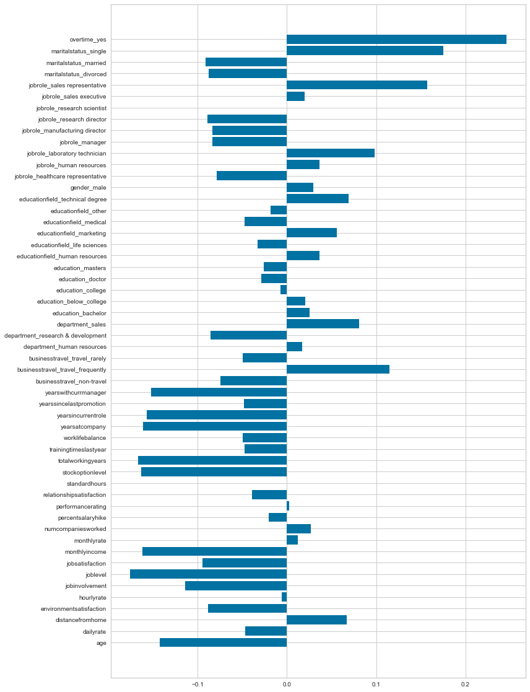

# Employee Attrition Data Analysis  
**OBJECTIVE-** Predicts the possible reasons of attrition in the given dataset of a company.  

## Feature Importance       
  

## Top five features  
* Overtime   
    
* Marital status  
    
* Job Role  
    
* Years with the current manager  
    
* Years in current role  
    

## Insights on all features
  
### 1) Age
Attrition seems to be more prevalent in the early career stages, most notably between the ages of 20 and 30. Whilst there is records of attrition at almost every age grouping, it would be beneficial to retain these younger employees and develop them within the business.

### 2) Monthly Income
While it isn't surprising that the people less paid are more likely to leave the organization, feature extraction in this area helped us understand that there are a few people despite their high pay, the attrition was higher in those roles.

### 3) Overtime
Employees that worked overtime had a much higher attrition rate compared to their colleagues that didn't. Making them work longer hours and making them arrive early/leave late all contribute to this attrition.  

### 4) Years at Company 
We can see that people who've been within the organization for less than 5 years have a really high attrition rate. There could be multiple factors that could contribute to this, but it's valuable for the company to try and retain these new talent as they actually bring a lot of value into the company. 

### 5) Business Travel
It's shown that people who travel often for work purposes are found to leave the organization more. The org probably asks their employees to travel a lot often and this contributes to a lot of health issues. And if the employee has a family, it may not let him/her spend enough time with his family and hence contributes to slight imbalance in their employees Work-Life balance. Hence, this feature contributes to attrition. It's important for the company to care and value their employees and do the best they can to make sure their employees don't feel impacted in anyway.

### 6) Marital Status
We can see that the attrition rate of unmarried people is lower, while for married people, the attrition rate is really high. This could be cause of different commitments to their relationship or changes in events of their life. 

### 7) Years in Current Role
From the graph, we can say that people with less years of experience in their current role have a higher attrition rate and then it drastically reduces. We can later see that there's a sudden increase in attrition at around 6-7.5 years. This could be due to factors like, less incentives, recognition, pay, or no growth within the organization. Orgs need to make an effort to value the work of their employees if they want to reduce the RoA.

## Four features contributing to Attrition  
* Overtime   
* Marital status  
* Job Role  
* Business Travel  

## Four features contributing to Tenure  
* Years with the current manager  
* Years in current role  
* Years at a company  
* Total working years  

## Sources
[Employee Dataset](https://www.kaggle.com/mattwarr23/predicting-attrition-using-machine-learning)   

## Authors and Acknowledgment  

[@Simrankumaran](https://github.com/Simrankumaran)   [@vgnsh333](https://github.com/vgnsh333)   [@Vcuber](https://github.com/Vcuber)   created this module with the guidance of [@rathishkumar](https://github.com/rathishkumar).  
